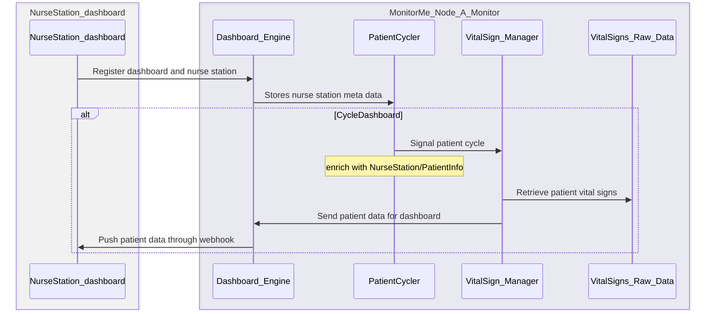

 Team Low-Code Architectural Katas by O'Reilly, February-March 2024

## Team members

From left to right:

    - Jeroen Bezemer (CTO / Principal consultant)
    - Joachim Vandecasteele (Solution Architect / Principal consultant)
    - Shahin Keshavari (Senior consultant)
    - Job Bezemer (Junior consultant)
    - Brian de Bruijn (Medior consultant)
        

## Table of Contents

<!-- TOC -->
* [Welcome](#welcome)
* [Executive summary](#executive-summary)
* [Presenting our solution](#solution)
  * [The business problem](#the-business-problem)
  * [MonitorMe requirements](#monitorme-requirements)
* [Architecture Characteristics](#architecture-characteristics)
  * [Others considered](#others-considered)
  * [Architecture style decision](#architecture-style-decision)
* [Distributed system with event-driven design](#distributed-system-with-event-driven-design) 
* [C4 - System design - MonitorMe](#c4---system-design---monitorme)
    * [C4 - Container design - Coordinator & Monitor](#c4---container-design---based-on-coordinator--monitor-role)
      * [Dashboard sequence flow](#dashboard-sequence-flow)
    * [C4 - Container design - Analyzer](#c4---container-design---based-on-analyzer-role)
      * [Analyzer sequence flow](#analyzer-sequence-flow)
      * [Handling alert on NurseStation](#handling-alert-on-nursestation)
        * [NurseStation Mockup](#nursesstation-mockup)
    * [New node Auto-configuration](#new-node-auto-configuration)
      * [Auto-configuration sequence flow](#auto-configuration-sequence-flow)
* [Security](#security)
* [Solution Outcome](#solution-outcome-work-inprogress)
* [ADR](#adr)
* [Video & presentation sources](#video-presentation---work-in-progress)
* [The Making Of & Learnings](#the-making-of--learnings-just-a-fun-part)

<!-- TOC -->

## Welcome

Welcome to the LowCodes Architectural Kata challenge by O'Reilly.
We are consultants working for [CoolProfs](https://www.coolprofs.com/en/about/coolprofs/) a company that specializes in building applications with Enterprise Grade Low-Code. 

To challenge ourselves and keep on learning we decided to commit our team to the O'Reilly Kata. This challenge took us out of our comfort zone and already delivered valuable new insights.

We believe that it does not matter if you build software in a high or low-code environment. Architecture is equally important to deliver a good solution. 

In our work, we do not only design it we also build and implement it. To help ourselves and our clients to always have an up-to-date architectural overview of their software landscape we believe in the power of automation. We use [C4 Modeling approach](https://c4model.com/) to design and automatically generate it from code to allow us a continuous comparison between the designed architecture and the realized architecture.

## Executive summary

With the new MonitorMe solution StayHealthy will successfully enter into the medical monitoring market. This new patient monitoring systems connects easy to the proprietary vital sign input sources and is fully integrated with current SaaS and Mobile solutions in the StayHealthy ecosystem.   

MonitorMe is build on a solid software and hardware architecture to ensure availability, concurrency, data integrity, performance, fault tolerance, responsiveness and data security of this critical patient monitoring system the hospital nurses, doctors and medical staff.  

An event-driven software architecture combined with a distributed-system hardware architecture covers all relevant constraints and architectural characteristics for the MonitorMe application with 24/7 availablity, no single point of failure, easy on-premises installation and scalability for the future.  
  
All vital signs measurements of the patients are stored and analysed in the MonitorMe solution. Medical staff can easily monitor 20 patients on the nurse station dashboards. Relevant alerts based on smart trends and thresholds to medical professionals on the Nurse station and StayHealthy mobile app. And finally holistic measurement snapshots of patients are send secure to MyMedicalData to medical staff.  

Team Low-code is ready to realize the MonitorMe solution for StayHealty Inc.  
  

## Solution

### The business problem

StayHealthy, Inc. is a large and highly successful ${\color{red}medical\ software\  company}$ located in San Francisco, California, US. They currently have ${\color{red}2\  popular\ cloud-based\ SAAS\ products}$: 

- MonitorThem is a comprehensive ${\color{red}data\ analytics\ platform\ that\ is\ used\ for\ hospital\ trend\ and\ performance\ analytics}$—alert response times, patient health problem analytics, patient recovery analysis, and so on.

- MyMedicalData is a comprehensive cloud-based ${\color{red}patient\ medical\ records\ system}$ used by doctors, nurses, and other health professionals to ${\color{red}record\ and\ track\ a\ patient's\ health\ records}$ with guaranteed partitioning between patient records.

StayHealthy, Inc. is now expanding into the medical monitoring market and needs a ${\color{red}new\ medical\ patient\ monitoring\ system\ for\ hospitals}$ that monitors a patient's vital signs using <u><i>proprietary</i></u> medical monitoring devices built by StayHealthy, Inc.

- MonitorMe will be the new medical patient monitoring system for hospitals

### MonitorMe requirements

<table>
  <thead>
    <tr>
      <th width="500px"> MonitorMe specifications</th>
      <th width="500px">Summary</th>
    </tr>
  </thead>
  <tbody>
  <tr width="600px">
    <td>
    MonitorMe reads data from eight different patient-monitoring equipment vital sign input sources (see table).

- It sends the data to a consolidated monitoring screen (per nurses station) with an avg resp. time of <=1 second
- The consolidated monitoring screen displays each patients vital signs, rotating between patients every 5 seconds. 
- There is a maximum of 20 patients per nurses station.
    </td>
    <td>

    - Send data <= 1 sec to Monitoring screen on Nurses station. 
    - Rotating Monitoring screen every 5 seconds on Nurses station 
    - Max 20 patient per Nurses stations 
      
    </td>
  </tr>
  <tr>
  <td>
  For each vital sign, MonitorMe must record and store the past 24 hours of all vital sign readings. A medical professional can review this history, filtering on time range as well as vital sign.
  </td>
  <td>

    - Store all vital sign reading for past 24 hours
    - View history by medical professional, filter on time + vital sign
    - System availability has to be available 24/7 
  
  </td>
  </tr>
  <tr>
  <td>
  In addition to recording raw monitoring data, the MonitorMe software must also analyze each patient’s vital signs and alert a medical professional if it detects an issue (e.g., decrease in oxygen level) or reaches a preset threshold (e.g., temperature has reached 104 degrees F).

   Some trend and threshold analysis is dependent on whether the patient is awake or asleep

  </td>
  <td>

    - Analyze each patient’s vital signs
    - Generate alert based on trend/thresholds to Nurses station & mobile App
    - Trend or threshold configurations (Global presets, not per patient)
    - Analysis is dependent on patient state (Awake or Asleep) 
  
  </td>
  </tr>
  <tr>
  <td>
  Vital signs that MonitorMe will have to support at launch. Each patient monitoring device transmits vital sign readings at a different rate.
  </td>
  <td>

    - Heart rate (every 500ms)
    - Blood pressure (every hour)
    - Oxygen level (every 5 seconds)
    - Blood sugar (every 2 minutes)
    - Respiration (every second)
    - ECG (every second)
    - Body temperature (every 5 minutes)
    - Sleep status (every second)
      
  </td>
  </tr>
  <tr>
  <td>
  MonitorMe will be deployed as an on-premises system. Each physical hospital location will have its own installation of the complete MonitorMe system (including the recorded raw monitoring data).
  </td>
  <td>
  
    - Own installation per hospital location of complete MonitorMe system
  
  </td>
  </tr>
  <tr>
  <td>
   Maximum number of patients per physical MonitorMe instance
  
  </td>
  <td>

    - Hard cap at 500 patients
    - Means max 25 nurses stations with 20 patients each

  </td>
  </tr>
  <tr>
  <td>
  StayHealthy, Inc. is looking towards adding more vital sign monitoring devices for MonitorMe in the future
  </td>
  <td>

    - Requires some scalability to support additional vital sign streams
  </td>
  </tr>
  <tr>
  <td>
Vital sign data analyzed and recorded through MonitorMe must be as accurate as possible. After all, human lives are at stake
  </td>
  <td>

  - Store and process RAW data for accuracy

  </td>
  </tr>
  <tr>
  <td>
  As this is a new line of business for StayHealthy, they expect a lot of change as they learn more about this new market
  </td>
  <td>
  
- Allow for easy upgrades
- Systems needs to be working 24/7, so rolling upgrade support if possible, no downtime

  </td>
  </tr>
  <tr>
  <td>
  StayHealthy, Inc. has always taken patient confidentially seriously. MonitorMe should be no exception to this rule. While patient monitoring data must be secure, MonitorMe does not have to meet any government regulatory requirements (e.g., HIPPA)
  </td>
  <td>

    - MonitorMe handles patient data, so secure storage and role-based access required
    - Auditing on snapshot functionality

  </td>
  </tr>
  </tbody>
</table>

## Architecture Characteristics

Based on the above requirements table we came up with these 7 Driving characteristics:

To ensure 24/7 correct simultaneous analysis of patient vital signs we have chosen Concurrency, Availability and Data Integrity as our top 3 Driving Architecture Characteristics

<table>
  <thead>
    <tr>
      <th width="300px"> Driving characteristics</th>
      <th width="600px">Justification</th>
    </tr>
  </thead>
  <tbody>
  <tr>
  <td>
  $${\color{red}Concurrency}$$  
  </td>
  <td>
MonitorMe will be receiving a lot of data for every vital sign from the patients. It is crucial that incoming data gets processed simultaneously so alerts can be sent in the quickest time possible when required to enable fast response times

 Requirements:

- analyze each patient’s vital signs
- Issue alert a medical professional
- Trend or threshold  (+ device failure)
- More vital sign monitoring devices​

  </td>
  </tr>
<tr>
  <td>
  $${\color{red}Availability}$$
  </td>
  <td>
  Patients need to be monitored 24/7 and if problems arise MonitorMe must be able to act. Therefore, the system needs to be always available and working

   Requirements:

  - Store all vital sign reading for past 24 hr
  - View history, filter on time + vital sign
  - Has to be available 24/7 
  
  </td>
  </tr>
  <tr>
  <td>
  $${\color{red}Data Integrity}$$
  </td>
  <td>
  Data loss can be disastrous, especially if that data would trigger any alerts if it were to be analyzed. Data Integrity must be maintained to ensure correct data analysis

   Requirements:

  - Store all vital sign reading for past 24 hr
  - View history, filter on time + vital sign
  - As accurate measurements as possible
  - Trend and threshold analysis is dependent on status awake or asleep 
  
  </td>
  </tr>
  <tr>
  <td>
  Performance and Responsiveness
  </td>
  <td>
  MonitorMe needs to have a high level of performance and responsiveness to provide real-time updates, alerts and a continuous stream of data. This will ensure a quick response time when emergencies arise and every second counts

   Requirements:

  - Send data <= 1 sec to Monitoring screen on Nurses station
  - Rotating Monitoring screen every 5 seconds on Nurses station 
  - View history, filter on time + vital sign
  
  </td>
  </tr>
<tr>
  <td>
  Fault Tolerance
  </td>
  <td>
  Partial system errors should be noticed, isolated and shouldn't impact the other systems. This helps to keep partially monitoring patients if at any time errors occur

   Requirement: 

  - MonitorMe must still function if a device or software fails. 
  
  </td>
  </tr>
  <tr>
  <td>
    Security
  </td>
  <td>
  Security is always important but since we are dealing with medical patient data it is even more a necessity to safeguard this

   Requirements:

- Generate holistic snapshots at any of consolidated vital signs
- Upload snapshot to MyMedicalData via secure HTTP API call
- Patient data must be secure
  
  </td>
  </tr>
  </tbody>
</table>

### Others considered

<table>
 <thead>
 <tr>
  <th width="200px">Characteristics</th>
  <th width="600px">Considerations</th>
</tr>
</thead>
<tbody>
<tr width="600px">
<td>

Recoverability

</td>
<td>

To meet the MonitorMe requirements, we need to prevent the possibility of getting into a situation where we need recoverability. Our focus is more on fail-over/high availability. Therefore, we have not included recoverability as one of the driving characteristics.

</td>
</tr>
<tr>
<td>

Abstraction

</td>
<td>

Abstraction was a factor because it lets users or system components reach their objectives more quickly without having to understand or view every detail. For example, a dashboard that is abstract would show the user the relevant data more easily than a dashboard that has too much data. This would not need any major changes in our architectural solution, which is why it is not listed as a driving characteristic.

</td>
</tr>
<tr>
<td>

Configurability

</td>
<td>

Configurability has been considered due to StayHealthy expecting a lot of changes since this is a new market for them. We decided that it was not crucial to shape our architectural solution based on this characteristic and so it is not a driving characteristic. 

</td>
</tr>
<tr>
<td>

Data consistency

</td>
<td>

We did not prioritize Data Consistency, because it is related to Data Integrity, which is already one of our main driving characteristics. We also anticipated a simple data model that would minimize or eliminate Data Inconsistencies, so we did not consider Data Consistency as a key factor.

</td>
</tr>
</tbody>
</table>

## Architecture style decision

For our software architecture we decided on 'Event-Driven'. [[ADR-0000]](Docs/Decisions/0000-use-event-driven-architecture.md)

- To support our new line of business and adapt quickly to the market
- Lower risk of adding additional features to the software
- To make MonitorMe 24/7 available even when upgrading we had to also think about the hardware architecture. 

Up to this point it was still an assumption we had to make. Once the physical architecture was decided we could evaluate it.

For our physical architecture we decided on the following requirements:

- 24/7 availability
- On-premise, so no cloud to rely on
- Easy to install, implement and upgrade
- No single point of failures within the MonitorMe instance
- Easily to replace/upgrade without downtime
- Futureproof, scale out if needed to support additional vital signs monitoring or other requirements that increases load. 

Based on the above we came up with a distributed system, see drawing [[ADR-0001](Docs/Decisions/0001-use-distributed-systems.md)]:

> [!NOTE]
> Each Node is one MonitorMe appliance

We accepted the additional NFR effort that a distributed system requires, such as:

- Synchronisation / replication
- Auto discovery
- Load distribution
- Auto failover

| :memo:        | Distributed systems will garantee [availability](#architecture-characteristics)       |
|---------------|:---------------------------------------------|
| Node        | A MonitorMe appliance that will act based on its given role. Roles are explained [here](#distributed-system-with-event-driven-architecture)
|Failover | Is built into the system so that even with one appliance left the most important functionality (analyzing & alerting) will be operational
|Synchronisation | Is built into the system to make sure each appliance can take on each role

A distributed system might allows for a possible downsize in the required hardware for the appliance itself which would benefit our new line of business in this market. [[ADR-0002]](Docs/Decisions/0002-appropiate-appliance-sizing.md). 

With these features in place StayHealthy inc. can garantee the following to their customers:

- MonitorMe will be configured once during installation by a StayHealthy consultant
- Configuration is auto shared with all discovered MonitorMe appliances
- Any MonitorMe appliance acts as plug-and-play. In case one fails the other 2 will take over it's role and continue to perform and deliver all functionality
- In the rare occasion that only 1 MonitorMe appliance is working it will limit its functionality to storing data, analyzing data and alerting. The nurses station will no longer function for the duration that only 1 MonitorMe applicance is active. If there is an alert during this time it will still be received by the mobile app.
- Once a new MonitorMe appliance is plugged in, the nurses station will automatically receive patient vital signs again
- This allows for enough time to replace the faulty MonitorMe appliance. StayHealthy can decide to also have a spare on-site or Same/Next day delivery.

### Distributed system with event-driven design

> [!NOTE] 
> Node = 1 MonitorMe appliance

One MonitorMe system exists out of a minimum of 3 identical appliances.
Each appliance will behave based on its assigned role. 
  For MonitorMe we have these roles:

- Coordinator (non functional role)
- Monitor (feeding nurses station with patient's vital signs)
- Analyzer (analyzing vital signs and sending alerts)

<table>
  <thead>
    <tr>
      <th width="500px"> MonitorMe appliances</th>
      <th width="500px"> Node roles</th>
    </tr>
  </thead>
  <tbody>
  <tr>
  <td>
Healthy system, all appliances in operation
  </td>
  <td>

- Node 1: Coordinator & Monitor
- Node 2: Analyzer
- Node 3: Analyzer
  </td>
  </tr>
  <tr>
  <td>
Semi-healthy system, one appliance down, 2 in function
  </td>
  <td>

- Node 1: Coordinator & Monitor
- Node 2: Analyzer
  </td>
  </tr>
  <tr>
  <td>
Unhealthy system, one appliance in operation
  </td>
  <td>

- Node 1: Analyzer
  </td>
  </tr>
  </tbody>
</table>

## C4 - System design - MonitorMe

### C4 - Container design - Based on Coordinator & monitor role

<b>Purpose: </b> Coordinator distributes vital signs to all nodes for processing according to their role. It also handles the cycling of patients for the Nurses Station subscriptions

<b>Datastores: </b> NurseStation MetaData stores all Patient data and NurseStation subscribers/Bed&Device relations. All data to communicate the right data to the right nurses station

> [!NOTE]
> Vital analyzer is always storing vital signs (short term) for trend analysis. Left flow out for readability

| :memo:        | Worker & eventBus are maintaining [concurrency](#architecture-characteristics)       |
|---------------|:---------------------------------------------|
| Worker        | A multithreading worker that asynchronous processes all incoming vital signs
| Eventbus| All events can be handled asynchronous and allows for multiple subscribers to same event

  

| :memo:        | Coordinator will uphold [Data Integrity](#architecture-characteristics). No alterations will be done to ensure data integrity    |
|---------------|:---------------------------------------------|
| worker        | Will send the data in it's raw form with the event to be stored. 
| VitalSignManager| Stores the raw data in the database for at least 24h.
| VitalSigns Raw Data| Holds the raw data of each vital sign for X period of time
| Analyzer data| Holds the raw data of each vital sign that requires analyzing its trend. This can differ per vital sign. The analyzer will not alter or aggragate this data in any way to uphold it's <b>integrity&consistency</b>.
|Analyzer| Analysis will always be done on the raw data coming from Analyzer data store, this will guarantee all analysis will be <b>accurate and consistent</b>

 

#### Dashboard sequence flow

### C4 - Container design - Based on Analyzer role

<b>Purpose: </b> Analyze all vital signs with configured thresholds or stored trend data. 

<b>Datastore 'AnalyzerData': </b> Holds all vital sign thresholds and minimal trend data for analyzing purposes

#### Analyzer sequence flow
For readability we left the event bus out of the sequence flow. Assume all communication goes through the Event BUS

#### Handling alert on NurseStation 

Description: Dashboard is connected through webhooks to MonitorMe, This allows for direct communication from MonitorMe to the Dashboard and instant showing of alerts. 

The dashboard is divided in 2 sections, one for showing patient information and vital signs. This will cycle on forever even when alerts appear. In a separate part of the screen we will reserve room for displaying alerts when they occur. Both are separate events to keep the logic simple.

##### NursesStation Mockup 

We decided not to create a mockup in this phase of architectural discovery. We will create the neccessary mockups to visualize what the end product can look like, once the StayHealthy management board agrees that this is the right direction. A short description of the Nurses station is given [here](#handling-alert-on-nursestation)
    
### New node Auto-configuration 

<b>Purpose: </b> To support easy installation of new appliances. Just replace the faulty appliance or add this appliance in the same rack. Once connected to the network and poweredOn it will make itself part of the distributed system

#### Auto-configuration sequence flow
For readability we left the event bus out of the sequence flow. Assume all communication goes through the Event BUS

## Security

The MonitorMe solution respects patient confidentiality. All devices that measure vitalsigns are wired to the MonitorMe solution. All data from patient monitoring is stored on-site at the Hospital. Data from measurements is stored in the AnalyzerData database and VitalSigns Raw Data databases. Patient (identity) data is stored in the encrypted NurseStation MetaData database. 

MonitorMe communicates with the NurseStation, MyMedicalData, StayHealty Mobile app only through secure HTTP API calls. All StayHealthy applications (NurseStation, MyMedicalData and StayHealty Mobile) require a secure login process by verified and authorized hospital medical staff and professionals. 

## Solution outcome
A summary of driving architecture characteristics and how it's solved by the solution  

<table>
  <thead>
    <tr>
      <th width="500px"> Driving characteristic</th>
      <th width="500px"> Solved</th>
    </tr>
  </thead>
  <tbody>
  <tr>
  <td>

[Concurrency](#architecture-characteristics)
  </td>
  <td align='center'>

:heavy_check_mark: [more info](#sequence-flow-for-coordinator--monitor)
  </td>
  </tr>
<tr>
  <td>

[Availability](#architecture-characteristics)

  </td>
  <td align='center'>

:heavy_check_mark: [more info](#architecture-style-decision)

  </td>
  </tr>
  <tr>
  <td>

[Data Integrity](#architecture-characteristics)

  </td>
  <td align='center'>

:heavy_check_mark: [more info](#measurement-flow---work-in-progress)  

  </td>
  </tr>
    <tr>
  <td>

[Performance and Responsiveness](#architecture-characteristics)

  </td>
  <td align='center'>

:heavy_check_mark: [more info](#distributed-system-with-event-driven-design)  
  </td>
  </tr>
    <tr>
  <td>

[Fault tolerance](#architecture-characteristics)

  </td>
  <td align='center'>

:heavy_check_mark: [more info](#architecture-style-decision)  

  </td>
  </tr>
    <tr>
  <td>

[Security](#architecture-characteristics)

  </td>
  <td align='center'>

:heavy_check_mark: [more info](#security)  

  </td>
  </tr>
  </tbody>
  </table>

   

Did we meet the requirements of MonitorMe?

 
<h3>Yes we did!</h3>

## ADR

[[ADR-0000 Use event-driven architecture]](Docs/Decisions/0000-use-event-driven-architecture.md) 
[[ADR-0001 Use distributed systems]](Docs/Decisions/0001-use-distributed-systems.md) 
[[ADR-0002 Appropiate appliance sizing]](Docs/Decisions/0002-appropiate-appliance-sizing.md)

## Video presentation

Team LowCodes video presentation 4 min 59secs without outro

https://youtu.be/dqBvXRlHctI

Team LowCodes video presentation 5 min 17 secs with outro

https://youtu.be/rNIhUrgyxT0

[Powerpoint presentation used for video](/Resources/Presentation/2024%20CoolProfs%20-%20Video%20Architecture%20Katas%20(FINAL).pptx)

## "The making of" & Learnings (Just a fun part...)

### Having fun in the R&D room

Team LowCodes working hard to create a video (Take 42!). This is part of the Science room (R&D) where all the magic happens

Special thanks to our video specialist and colleague: Guido Vandecasteele

We also want to thank the local pizza delivery, we couldn't have done it without! Pizza, Cola and Beer our personal driving characteristics!

### Learning

We had a blast and learned a lot. We also found out that 4-8 hours for this assigned, at least for us, was nowhere near enough. We didn't mind since it's a great challenge. It did mean that we had to do a lot of long evenings. So try to keep some days free from work and see this as a great learning experience and teambuilding effort, am sure your company will not mind.

What new learnings did we do:

  - ADR's, no experience with them at all. We had hours and hours of discussions and made decisions, but did not immediately write them down. Try to read up about the ADR structure and start recording your decisions from the start. Now that we have gotten some experience with them I am sure we will start using them. They are great for those moments where you have to explain the Why.....few months later.
  - Github / Markdown language, again little to no experience. Google and VSCode were our friends in this. Took some time to figure out how to do some basic styling, luckily html is no stranger to us. VSCode helped to keep things simple and sync it to Github. Maybe a few plugins to help you preview it better instead of syncing everytime ;)
  - Take a lot of pictures and just have fun, order pizza or whatever is your fuel to keep on going!
  - Retro your experience, we did that once and will do the last one after the finals. It will help us to look back on what we have accomplished and better yet, how can we use this experience with our current work and give those tips to the next LowCodes team when they enter Katas.
  - The O'Reilly learning platform, use it! Lots of great books, video's and events to be found on it. You will have free access during the Katas. Badges kept flowing in ;)
  We will see how we can incorporate this with our Cool Academy team to share the knowledge within our company.
  - Github doesn't support files larger then 25mb, so don't expect your videopresentation to be hosted on github. We used wetransfer to send it to the judges (hoping that works and is accepted). As a fail-safe we also uploaded them to youtube and added the links in the [video presentation](#video-presentation) section

